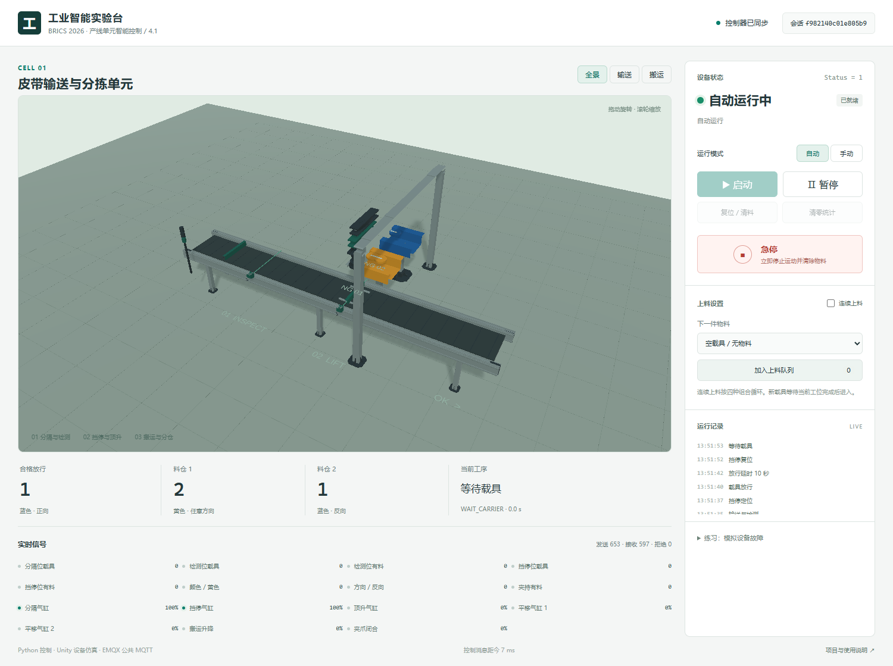

# 工业智能实验台：皮带输送与分拣

面向金砖大赛“工业智能应用与开发”样题 4.1 的练习工程。Python 决定状态和工序，Unity 模拟设备动作及传感器，通过 `broker.emqx.io` 公共 MQTT 服务闭环通信。

**可运行版本已完成：真实 Unity WebGL 场景经公共 EMQX 与 Python 闭环联调通过。**最新记录见 [验收记录](docs/validation.md)。



## 已实现的功能

- 四状态：闲置 0、自动 1、暂停 2、急停 3；对应黄常亮、绿常亮、黄/红亮 1 秒灭 1 秒。
- 初始化挡停伸出、顶升缩回；按真实位置反馈推进分隔、检测、挡停、顶升和搬运步骤；挡停缩回后延时 10 秒并确认载具离开。
- 蓝色正向放行；黄色任意方向进料仓 1；蓝色反向进料仓 2。
- 两个平移气缸、升降和夹爪；暂停保留位置和夹取关系；急停清除虚拟物料，复位后等待重新启动。
- 单载具串行生产、连续混合上料、指定物料排队、空载具、统计和气缸卡住练习。
- 会话隔离、场景代次、消息时效及序号校验、断线/隐藏标签页保护；控制器重启遇到在制品需复位。

这是**功能等价的练习环境**。材料没有完整 I/O 表和全部动作步骤，未提供的点位采用项目自定义名称，不宣称能直接提交到比赛平台。

## 运行环境

| 工具 | 当前锁定/实测 |
|---|---|
| Unity | 6000.3.24f1（6.3 LTS），需要 Web Build Support 和已激活许可证 |
| Python | 3.10 以上；本机测试为 3.14 |
| Node.js | 支持已锁定的 MQTT.js 5.15.2、esbuild 0.28.2 |
| .NET SDK | 8.0，仅用于独立执行 C# 设备模型测试 |
| Blender | 5.2，仅在重新转换资产时使用，常规运行不需要 |

## 首次准备与构建

在仓库根目录打开 PowerShell：

```powershell
.\scripts\setup.ps1
.\scripts\build-webgl.ps1 -UnityEditor 'D:\UnityEditors\6000.3.24f1\Editor\Unity.exe'
```

Unity Hub 中先登录并激活自己的许可证。构建过程生成网页模板、导入已转换 FBX、创建 `Cell` 场景，再输出 `web/dist`。构建日志在 `artifacts/unity-build.log`；首次导入和 IL2CPP 编译需要时间。实际构建失败时应先检查日志，不能用源网页替代 Unity WebGL。

在 Unity Editor 中可打开 `unity` 工程，菜单 **Industrial Cell → Create or rebuild scene** 创建场景。Editor 仅显示设备预览；本工程 MQTT 通信路径在 WebGL 浏览器中运行。

## 启动实验

日常使用时，直接双击项目根目录的 **`start.cmd`**。它会调用现有启动脚本并自动打开浏览器；失败时保留窗口显示错误。从其他目录或快捷方式启动也可以。

完成 WebGL 构建后：

```powershell
.\scripts\start.ps1
```

脚本在后台启动 Python 控制器和本地静态服务，生成随机会话，打开浏览器。页面显示“控制器已同步”“已就绪”后点击“启动”。默认按四种颜色/方向组合连续运行。

- 暂停：停止当前运动，保留工序；在自动模式重新启动继续。
- 急停：立即在 Unity 本地锁止并清料；释放急停后回闲置初始化，再手动启动。
- 复位/清料：闲置或暂停时使用；新场景代次使旧消息失效。
- 清零统计：仅闲置时可用，避免影响正在确认的分拣结果。
- 关闭“连续上料”，选择组合并“加入上料队列”，可逐件练习。
- 切换后台标签页会冻结设备；返回后需要重新启动，不补播后台运动。
- 故障练习：选择气缸卡住，等待控制器报告超时；排除故障后复位。

停止后台进程：

```powershell
.\scripts\stop.ps1
```

或分别在两个终端运行，使用同一会话（8–64 位字母、数字、`_`、`-`）：

```powershell
.venv\Scripts\python.exe scripts/serve.py --port 8765
.venv\Scripts\python.exe -m controller.main --session my-training-0001
```

然后打开 `http://localhost:8765/?session=my-training-0001`。两个终端命令应分别运行。运行日志、进程号和当前会话放在 `runtime/`，不提交到 Git。

## 测试与数据链路

```powershell
.venv\Scripts\python.exe -m pip install -r requirements-dev.txt
.\scripts\test.ps1
npm.cmd --prefix web run test:mqtt
.\scripts\test-webgl.ps1
```

`test-webgl.ps1` 使用本项目 D 盘缓存中的 Chromium，实际加载 Unity WebGL，测试分拣流程、页面刷新、控制器重启、执行暂停和 WSS 断开恢复。需要公网连接，报告保存在 `artifacts/`。

Python 测试直接驱动 `unity/Assets/Scripts/DeviceModel.cs` 编译的测试进程，检查实际设备位置、抓取成功和分仓计数；没有另写一份 Python 仿真来替代 Unity 设备逻辑。公网探针仅在随机会话主题收发虚拟测试消息。

通信采用 Python TCP `broker.emqx.io:1883` 与浏览器 WSS `wss://broker.emqx.io:8084/mqtt`。随机主题减少误串台，**不构成认证隔离**。只用于虚拟练习，不发送真实设备凭据或私人数据。公网延迟不保证硬实时。

## 代码与资产

| 目录 | 用途 |
|---|---|
| `controller/` | 状态机、工序、Paho MQTT 运行器 |
| `unity/Assets/Scripts/` | 设备模型、模型装配、浏览器桥接 |
| `unity/Assets/Resources/Industrial/` | 从 OIP GLB 转换的 FBX 工业部件 |
| `web/` | 操作面板、MQTT.js、协议防重放、Unity 网页模板生成 |
| `tests/` | 状态机、协议、真实 C# 设备模型闭环测试 |
| `protocol/` | 点位定义和消息契约 |
| `scripts/` | 准备、构建、运行、停止、测试和模型转换 |
| `third_party/` | 上游仓库、提交、资产校验及许可证 |

主要工业部件复用 [Open Industry Project](https://github.com/Open-Industry-Project/Open-Industry-Project)，保持 MIT 通知。场景采用近似装配；皮带平面、地面标记、指示灯和测试工件使用简单几何。没有从零重建整套工业设备。详见 [第三方来源](third_party/README.md)。

## 提交与回退

以阶段性 Git 提交作为检查点：`c8ecf66` 为设计基线，`fab4aa9` 为源码实现基线。WebGL 联调完成的检查点见 Git 最新提交及验收记录。

若同一问题多次失败，先保留日志与当前工作分支，再从最近有效提交创建修复分支；已经推送的错误提交优先用 `git revert` 撤销。不要覆盖远端历史，也不要把 `.venv`、Unity Library、安装包或运行会话提交进仓库。
