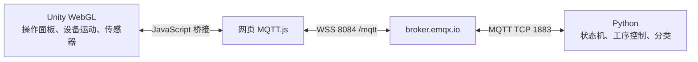

# 4.1 产线单元智能控制：Python + Unity WebGL 讨论稿

日期：2026-09-13。用户已批准实施，并指定 GitHub 仓库 wanbro333/industrial_ai_dev。本文保留设计基线，实际完成情况见 progress.md。

用户已确认：Unity 首版在浏览器运行；优先复用现成模型，使模块布局、信号和动作对应材料，不要求零件外观逐一复刻。

## 1. 总体目标及实施顺序

总体完成 PDF 第 5 页 4.1 的三个要求：四状态与灯联动、皮带自动检测和 NG 剔除、全单元按 NG 类型搬运分类及急停清料。按四个模块组织工程，但按可验收的闭环逐步交付。

首个可运行版本完成“状态机 + 皮带 + 指示灯 + 操作面板 + MQTT”。随后补齐检测、输送工序及搬运机构，最终验收整项 4.1。首版状态机完成不代表整项 4.1 已完成。

| 四个模块 | 本阶段具体内容 | 材料依据 |
|---|---|---|
| 状态机控制 | Status=0/1/2/3、启动、停止、手自动旋钮、急停及急停复位、红黄绿灯 | 截图 158，PDF 4.1 第 1 条 |
| 皮带输送 | 电机、载具、物料、分隔气缸、挡停气缸、顶升气缸、到位和有料检测 | 截图 159，PDF 4.1 第 2 条 |
| 分拣搬运 | 两组平移气缸、升降气缸、夹爪、原位/到位检测、两个料仓 | 截图 160，PDF 4.1 第 3 条 |
| 检测及分类 | 颜色、方向、OK 放行、NG 类型判定、搬运目标及结果计数 | 截图 161，PDF 4.1 第 2、3 条 |

截图 160 的机构是气动平移搬运机构。本阶段无需六轴机械臂逆运动学或 Flange，也不开展 PDF 4.2—4.7 的项目。

## 2. 两种仿真方案的比较

**推荐：受控运动 + 传感器反馈。** 皮带沿约束路径输送载具，气缸按行程移动，传感器根据实际位置/触发区产生输入，夹爪闭合且物料位于抓取范围才允许附着。运动由输入输出驱动，支持中途暂停和到位超时；不把整线做成固定时长动画。适合练习 PLC 式顺序控制，浏览器负担较轻，结果可重复。

**备选：全刚体接触物理。** 通过皮带摩擦推动物料、刚体接触完成夹取，可研究滑移和碰撞，但调参、抖动和跨设备表现更难控制，增加本题不要求的工作。若后续要研究机械动力学，再逐个设备替换。

为保持实现边界清晰，正常工艺逻辑全部在 Python；Unity 负责设备响应及反馈。两端通信仍然按真实收发运行。

## 3. 架构与运行方式

- Python：独立虚拟环境，Paho MQTT、transitions；单个控制循环处理输入快照、事件优先级、状态转换和工序步骤。MQTT 回调只放入队列，避免回调线程和控制线程同时修改状态。
- Unity：建议 Unity 6.3 LTS、Web Build Support、适合 Web 的轻量渲染设置。C# 操作设备和传感器，使用官方 JavaScript 插件机制与网页 MQTT.js 双向传递 JSON。
- 浏览器：使用 `wss://broker.emqx.io:8084/mqtt`，Python 默认按用户指定服务器使用 `broker.emqx.io:1883`。它们是同一 broker 的不同接入方式，使用相同主题即可通信。
- 网页静态文件通过本地 HTTP 服务预览；后续可放到支持 WebGL 构建头部配置的静态站点。直接双击 HTML 不作为运行方式。本轮不发布外部网站。
- WebGL 构建与运行分别验收：首次加载、JS 桥接、WSS 连接、Unity 实际运动、浏览器刷新恢复。压缩格式、Content-Encoding、WASM MIME 等由构建及静态服务配置配套处理。

EMQX 端口依据：[官方公共服务器说明](https://www.emqx.com/en/mqtt/public-mqtt5-broker)。Unity 接口依据：[浏览器脚本交互](https://docs.unity3d.com/6000.0/Documentation/Manual/webgl-interactingwithbrowserscripting.html)、[Web 网络限制](https://docs.unity3d.com/6000.0/Documentation/Manual/webgl-networking.html)。

## 4. 四状态机及复位语义

| Status | 名称 | 指示灯 | 设备行为 |
|---:|---|---|---|
| 0 | 闲置/复位后 | 黄灯常亮 | 皮带停止；初始化步骤完成后等待启动 |
| 1 | 自动运行 | 绿灯常亮 | 允许按工序控制电机、气缸和搬运机构 |
| 2 | 暂停 | 黄灯亮 1 秒、灭 1 秒 | 停止工艺运动，保留物料、夹取关系和工序步骤 |
| 3 | 急停 | 红灯亮 1 秒、灭 1 秒 | 立即抑制运动，清除所有虚拟物料和在制品记录 |

状态 1 表示自动运行模式；某个工序需要挡停定位时，皮带实际输出可以为停止，不把 Status=1 简化为电机永远通电。

正常转换严格对应截图：

- 闲置 -> 自动运行：自动模式 + 新的启动按键事件 + 初始化完成。
- 自动运行 -> 暂停：停止按键，或旋钮切至手动。
- 暂停 -> 自动运行：自动模式 + 新的启动按键事件，且传感器快照有效。
- 任意非急停状态 -> 急停：急停触发，优先于其他输入。
- 急停 -> 闲置：急停按钮复位；重新初始化，之后需要再次启动，不自行恢复生产。

“复位”是操作/初始化过程，与截图 Status=0 的“闲置”统一；不新增第五个业务状态。`ready`、`initializing`、`fault_code`、`comm_ok` 等是独立字段。

已知初始化目标：挡停伸出、顶升缩回。分隔气缸、平移、升降、夹爪的具体初始目标在设备 I/O 定义中补齐并明确标为本项目约定。初始化可在 Status=0 中移动回原位，但电机和自动上料保持停止；因此“闲置”不等价于所有初始化动作都被禁用。

补充规则作为本项目建议：急停 > 停止/切手动 > 启动；按住启动不重复触发；暂停不清料且冻结工序计时，网络监测与灯闪烁仍继续；已完成统计由独立“清零统计”操作清除。灯闪烁由 Unity 本地计时，不通过公网每秒发送开关，不因重复状态报文重新起相位。

普通“复位”按钮与急停按钮释放分开：建议普通复位只在闲置或暂停时接受，先清除虚拟物料和在制队列、更新场景代次，再回到闲置初始化；运行时须先停止，急停未释放时不能靠普通复位解除急停。这是补充设计约定，截图没有给出普通复位的完整行为。

## 5. 设备、检测与分类

**皮带和工位。** 区分载具与物料对象，各有标识：空载具可触发“小车检测”，不能触发“有料检测”。设置检测区、挡停区、顶升定位区和出口区。初始化、分隔放入一个载具、检测数据锁存、挡停定位、放行/等待搬运、清空占位后复位均以反馈条件推进。

**传感器。** 到位信号来自运动部件的实际位置，有料信号来自检测区内的物料。颜色由检测器读取物料颜色属性，方向由物料实际姿态与基准方向比较；Python 只收到检测信号和跟踪标识，自己计算分类结果。该阶段模拟颜色/方向传感器，不增加摄像头视觉模型训练。

**分拣规则（来自截图 161）。**

| 颜色信号 Input15 | 方向信号 Input14 | 结果 |
|---|---|---|
| FALSE：蓝色 | FALSE：正向 | OK，皮带放行 |
| FALSE：蓝色 | TRUE：反向 | 方向 NG，搬运至料仓 2 |
| TRUE：黄色 | FALSE：正向 | 颜色 NG，搬运至料仓 1 |
| TRUE：黄色 | TRUE：反向 | 颜色 NG，搬运至料仓 1 |

黄色规则优先，避免黄色反向被重复分类或投至错误料仓。

**搬运工序建议。** 接收 NG 移交 -> 检查皮带定位及升降安全位置 -> 移到取料位 -> 下降 -> 夹爪闭合并确认夹取 -> 上升 -> 平移到目标料仓 -> 下降 -> 松爪 -> 上升 -> 返回原位 -> 确认任务完成并放行空载具。具体位置组合不能从截图完整还原，将按机构装配后定义行程表，再与完整题目步骤对齐。

“指令已收到”与“设备已到位/抓取完成”是两个不同反馈。收到 ACK 不直接推进到下一动作；必须等相应到位/有料信号。升降未到安全高度时禁止水平搬运，待搬运工位占用时不放入下一件。

**已能读出的部分 I/O。** 截图将部分输入写为 Q 区地址，先保留原样为来源映射值，不自行改为 I 区。本项目 MQTT 内部采用语义名称，后续适配原平台时再映射地址。

| 来源符号 | 截图地址 | 含义 |
|---|---|---|
| Input4 | Q100.4 | 检测工位有料 |
| Input5 | Q100.5 | 挡停工位有料 |
| Input6 | Q100.6 | 分隔位小车检测 |
| Input7 | Q100.7 | 挡停位小车检测 |
| Input8 | Q101.0 | 分隔气缸伸出检测 |
| Input14 | Q101.6 | 方向，TRUE 为反向 |
| Input15 | Q101.7 | 颜色，TRUE 为黄色 |
| Output3 | Q0.3 | 皮带电机启动 |
| Output8 | Q1.0 | 分隔气缸输出 |

这不是完整 I/O 表。截图未显示的缩回检测、挡停/顶升输出、搬运机构全部点位以及完整工序步骤仍待补充。功能等价仿真可以先使用明确命名的自定义点位，不声称可直接替换原比赛程序。

## 6. MQTT 消息约定与通信保护

建议每次练习生成独立会话前缀 `brics2026/<随机会话>/cell01/`，网页和 Python 使用同一会话配置。

| 后缀 | 方向 | 内容 | 建议传输 |
|---|---|---|---|
| `ui/events` | Unity -> Python | 启动、停止、手自动、复位、急停事件 | QoS 1，不 retained |
| `device/inputs` | Unity -> Python | 传感器、实际位置、载具/物料跟踪 | 变化立即发送；低频完整快照，非 retained |
| `control/outputs` | Python -> Unity | 电机和气缸目标、动作允许、当前 Status、阶段 | QoS 1，不 retained |
| `device/ack` | Unity -> Python | 指令接收/应用/拒绝反馈 | QoS 1，不 retained |
| `device/events` | Unity -> Python | 夹取、放料、出口通过、保护触发等 | QoS 1，不 retained |
| `health/<角色>` | 双向 | 在线状态、心跳、故障 | 定期心跳；在线/离线可用 retained 和 LWT |

JSON 包含协议版本、会话、场景代次、发送角色、消息编号、递增序号和数据。设备输出使用幂等目标，例如“气缸目标伸出”，不使用会重复累加的“再移动一段”。QoS 1 允许重复，因此去重、过期检查和应用 ACK 都在协议层实现。

- 初次握手先确认当前 Unity 场景代次、完整输入和 Python 控制器身份；同一会话只接受一个控制器和一个活动仿真实例。
- Unity 刷新、急停清料或场景重建时更新场景代次；所有旧代次指令、按钮事件和在制队列作废。
- 动作命令使用短有效期和序号校验；断线不无限缓存运动命令。重连后清理旧队列，重新握手和获取输入，恢复到停止/待启动状态。
- 以本地收包时间监测心跳新鲜度，不能把 broker 连接正常等同于控制器或仿真逻辑仍正常。
- 建议起点：控制循环 20 Hz；输入变化即时发送并每秒 5 次完整快照；心跳 1 秒；连续 3 秒无有效对端心跳触发保护。数值是待实测调整的工程参数，不是比赛原文。
- 通信保护导致运动冻结、禁止新动作，Python 可联动进入暂停；显示通信故障，不把断网伪装成比赛急停并清料。保留本地故障锁定，重连和重新按启动前不恢复运动。

**急停有本地执行路径。** 网页急停按钮先在 Unity 下一次仿真更新停止运动并清除全部物料，包括被夹爪抓住的物料，再通过 MQTT 同步 Python；收到 Python 急停报文时也做相同处理。失联时本地急停仍可使用。公网传输没有确定时延，因此不把远端按钮经公网的延迟描述为硬实时安全回路。

**浏览器后台行为。** 标签页隐藏时冻结工艺运动、提交暂停/不可用事件；若事件未能发出，Python 由过期输入/心跳进入保护。标签页恢复时先核查场景代次及通信状态，禁止补播长时间累计动作，用户重新启动后继续。瞬时失焦与隐藏分开处理，允许同屏操作 Python 终端。灯闪烁验收在前台页面进行。

EMQX 公共 broker 的消息可被其他用户看到。随机主题减少误串台，不提供认证隔离；只发送虚拟数据，不放入真实设备地址、凭据或个人信息。此项目仅模拟设备。

## 7. 参考库与资产使用计划

以下 Stars 是 2026-09-13 页面显示的约数。上游身份、许可证、维护和依赖审计与 Stars 一起判断，不称任何仓库绝对安全。

| 项目 | Stars | 拟使用内容 |
|---|---:|---|
| [Eclipse Paho Python](https://github.com/eclipse-paho/paho.mqtt.python) | 2.4k | Python MQTT 收发、连接和回调参考 |
| [MQTT.js](https://github.com/mqttjs/MQTT.js) | 9.1k | 浏览器 WSS 客户端，构建产物随网页本地打包 |
| [transitions](https://github.com/pytransitions/transitions) | 6.6k | 四状态定义和受条件约束的转换；关闭自动生成的任意跳转入口 |
| [Open Industry Project](https://github.com/Open-Industry-Project/Open-Industry-Project) | 816 | 工业输送、传感器、挡停和龙门机构的模型及行为参考 |

工业资产来源：[OIP 3DModels](https://github.com/Open-Industry-Project/Open-Industry-Project/tree/master/assets/3DModels)。已发现部分 GLB；另外一些是 Godot .res/.tres 或脚本化场景，需离线导出后导入 Unity，不能直接复制 Godot 工程使用。

下载进入实施阶段后进行：从上游仓库锁定发行 tag/commit，记录地址、版本、提交、文件校验及许可证；包管理依赖同时锁定；保留必要通知。先阅读构建/安装脚本和依赖，再执行受控构建，不运行陌生一键脚本。Paho 上游只为最新发行版提供安全更新，锁版后仍保留安全更新流程。

**模型导入先验收再扩建：**

1. 先获得并在 Unity WebGL 中展示一段输送带、一个气缸/挡停机构和一种传感器，检查单位、轴向、材质、枢轴和可动部件层级。
2. 复用工业框架、轨道、夹具和料仓模型完成装配，新增内容以碰撞体、传感器区和控制脚本为主。
3. 专用格式导出、贴图缩减、材质替换和部件重新装配属于资产适配；不从零制作主要工业模型。
4. 若现有仓库缺少独立气缸、夹爪或料仓，列出具体资产缺口并继续找有明确许可的来源。任何收费资产或许可不明确资产都不纳入默认方案。
5. 导入模型的行为脚本与几何资产分开处理；只复用所需资源，不把其他平台的 PLC 通信模块带进 WebGL。

资产种类较窄，因此不能承诺每个模型来源都有数千 Stars，也不能承诺已找到截图全部配套模型。当前用户接受近似外观，这使组件复用和资产适配可作为主路线。

## 8. 交付里程碑

| 阶段 | 具体交付 | 验收点 |
|---|---|---|
| M0：约定与资产试验 | I/O 草表、消息契约、锁定来源、Unity 与 Web 构建环境、代表性模型导入试验 | 浏览器能加载工业部件；Python 与 Web MQTT.js 经指定 EMQX 交换带会话标识的测试消息 |
| M1：第一份可运行版本 | 四状态 Python 控制器、Unity WebGL 皮带和载具、操作面板、灯、连接状态 | 在网页操作启动/停止/手自动/急停，Python 正确转换并回发控制；灯的颜色与 1 秒闪烁正确；急停清料、复位不自启动 |
| M2：输送与检测 | 分隔、挡停、顶升、空载具/有料区分、颜色/方向检测、材料跟踪 | 初始化正确；蓝色正向可放行；NG 稳定挡停等待搬运；暂停后恢复同一步骤。本阶段尚不单独宣称完整满足 PDF 的 NG 剔除要求 |
| M3：搬运与全单元联动 | 两组平移气缸、升降、夹爪、两个料仓、返回和释放工位 | 黄色进 1 仓；蓝色反向进 2 仓；蓝色正向直通；NG 物料从线上实际移走，空载具可继续放行，至此完整覆盖 PDF 4.1 第 2、3 条 |
| M4：连续流程与交付 | 混合物料重复运行、异常验证、WebGL 构建包、控制器、测试、说明、来源清单 | 无漏分、错分、重复计数、旧命令复活；可复现启动和演示 |

先确保每次放入一个载具的顺序流程正确，再增加受分隔器控制的连续上料。吞吐量优化不是首轮目标。

建议交付目录（只是规划，尚未创建应用工程）：`controller/`、`unity/`、`web/`、`protocol/`、`tests/`、`docs/`、`third_party/`。主配置集中管理 broker、会话、设备行程和仿真速度，避免分散硬编码。

## 9. 验收场景

- 自动模式启动、停止暂停、切手动暂停；手动时启动不进入自动运行。
- 四状态均可触发急停；同时出现启动/停止/急停时按优先级处理。
- 暂停发生在输送中、气缸运动中、夹持中；恢复后保持物料及工序一致。
- 急停发生在上述任意位置时，运动停止，全部物料和在制队列清空；旧消息不会让物料再出现或设备继续运行。
- 急停复位回闲置，挡停伸出、顶升缩回，未重新启动不生产。
- 四种颜色/方向组合全部正确；同一物料仅计数一次。
- 空载具检测与有料检测区分正确；工位忙时分隔器不放入下一载具。
- 气缸不到位时停在等待步骤并报告具体超时，不继续错误搬运。
- QoS 1 重复、乱序或过期动作消息不会重复夹取/放料/上料。
- 断开 Python、断开网页网络、刷新浏览器、隐藏标签页后恢复，均不自动重放运动命令。
- 通过真实 WebGL 构建验证 MQTT.js 桥接，而非只在 Unity Editor 中验证。
- 在前台浏览器记录帧率、MQTT 往返延迟和动作反馈时延；公网时延如实报告，不能用本地回放代替公网验收。

## 10. 讨论与实施前需完成的细化

已确定：WebGL、公共 EMQX、Python 控制、复用近似模型、四模块范围。

建议用户下一轮重点讨论：

1. 暂停采用“停住当前动作，保留物料与夹持，重新按启动后继续”；急停采用“清料，复位回原位，再启动重来”。
2. 完整 I/O 表与具体 11 步等流程尚未出现在材料中。先实现功能等价、可配置点位的练习环境；如需逐地址/逐步骤复刻，后续对齐完整题目。
3. 确认代表性资产导入和运行环境后，再锁定具体 Unity 补丁版本、Python 依赖版本、气缸行程和通信超时参数。当前不把尚未实测的数值作为承诺。

用户已批准按本方案开始实施。缺失的原比赛点位仍按文中约定处理；分阶段提交，保留可回退的工作检查点。
